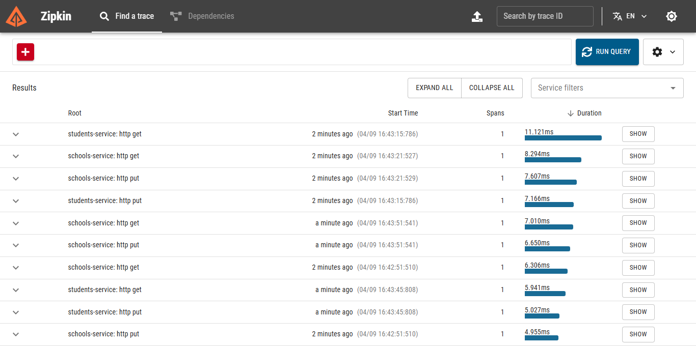

# 🧩 Microservices Architecture with Spring Boot

This project demonstrates a **Microservices Architecture** built using **Spring Boot** and **Spring Cloud**. It includes service discovery, centralized configuration, intelligent routing, inter-service communication, distributed tracing, and PostgreSQL as the persistent layer.

---

## 🏗️ Project Architecture


---

## 📦 Modules Overview

### 1. `config-server`
- Centralized configuration management for all microservices.
- Fetches configuration from a Git-based repository.

### 2. `discovery-server` (Eureka)
- Acts as a service registry.
- Enables microservices to discover and communicate with each other.

### 3. `api-gateway`
- Single entry point to the system.
- Uses **Spring Cloud Gateway** for routing and filtering.
- Communicates with Eureka for service resolution.

### 4. `student-service`
- Handles all operations related to students.
- Communicates with PostgreSQL to manage student data.

### 5. `school-service`
- Manages school-related operations.
- Uses **OpenFeign** to fetch related student data from `student-service`.

---

## 🔁 Inter-Service Communication

- Handled via **OpenFeign**, a declarative REST client.
- Example use case: `school-service` fetches the list of students associated with a specific school from `student-service`.

---

## 🚀 How to Run the Project

### Prerequisites
- Java 17+
- Maven
- Docker & Docker Compose

### Step-by-step Setup

1. **Start Docker containers** for PostgreSQL, PgAdmin, and Zipkin:
   ```bash
   docker-compose up -d

2. **Run Spring Boot services in the following order:** :
   - `config-server`
   - `discovery-server`
   - `api-gateway`
   - `school-service`
   - `student-service`
     
> Each service will register with Eureka and fetch its configuration from the config server.

---


## 📈 Distributed Tracing with Zipkin

- Zipkin is integrated into each microservice.
- Helps visualize and trace requests across services.


Access the Zipkin dashboard at:  
👉 `http://localhost:9411`

---

## 🛠️ Tech Stack

| Technology        | Description                                |
|-------------------|--------------------------------------------|
| Spring Boot       | Framework for building microservices       |
| Spring Cloud      | Config, Eureka, Gateway, OpenFeign         |
| PostgreSQL        | Relational database                        |
| Docker            | Containerization platform                  |
| Docker Compose    | Multi-container orchestration              |
| Zipkin            | Distributed tracing tool                   |

---

## 📬 Author

**Azza Ben Romdhan**  
💼 Software Engineer  
🔗 [LinkedIn Profile](https://www.linkedin.com/in/azza-ben-romdhan-668987177/)
